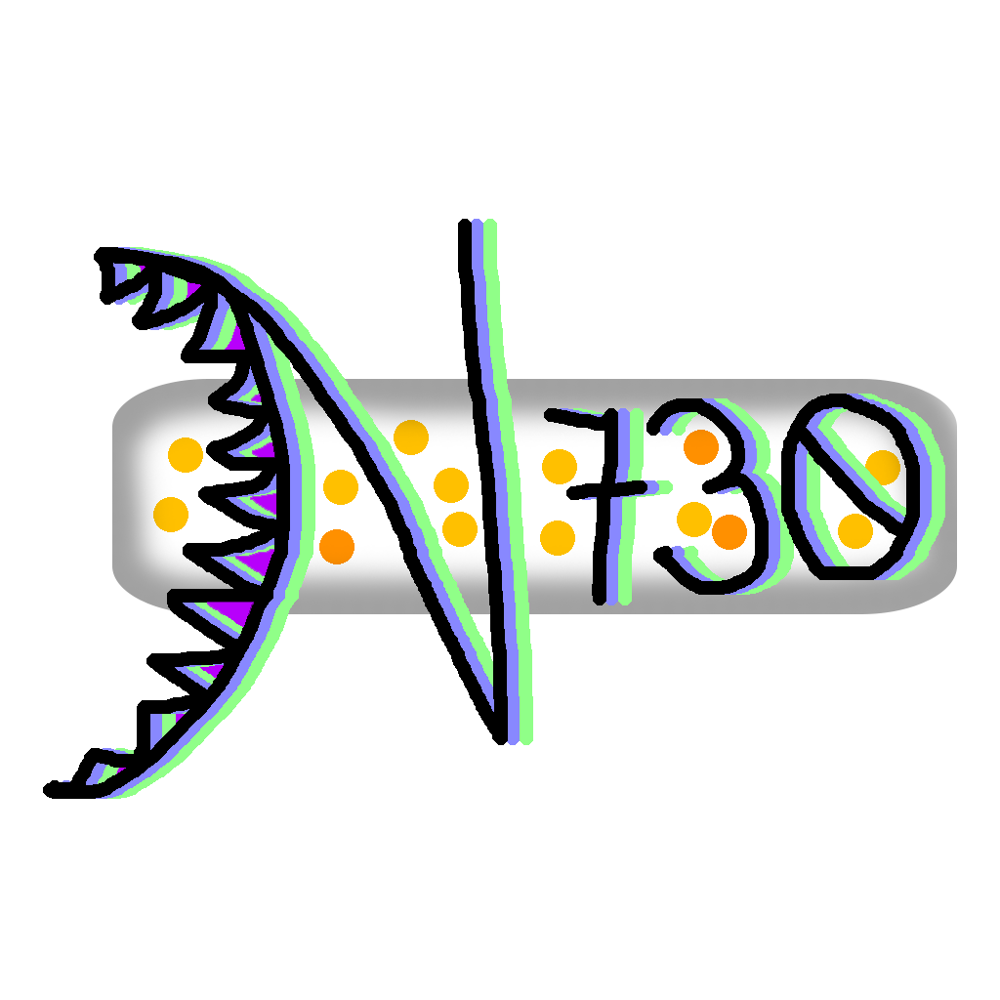

  

<h1 align="center">N730</h1>

  Experimental streamed transformer inference for legacy GPUs.

  
  
  
  

---

# What is N730?

This stuff is built to run AI LLMs locally using streamed quantization on a GT 730(a Kepler-era card). It supports Qwen-like LLMs right now and uses HuggingFace as its model provider.

Setup and usage instructions coming soon after this gets to a almost working state.

## License

MIT 

## Disclaimer

N730 is an experimental research project haha.

Performance, correctness, and stability are not working send help pls

This project is not affiliated with NVIDIA, DeepSeek, HuggingFace, or any model provider. F*ck big model providers.

**EXTRA NOTES**
- You are absolutely not allowed to sell or make money from this software commercially, whether it be through access limits, usage or donations.
- If any modifications that you think would help this project further, please do a PR.
- Grammatical or style issues do not require a PR, do an issue instead. Such PRs will be closed without notice.
