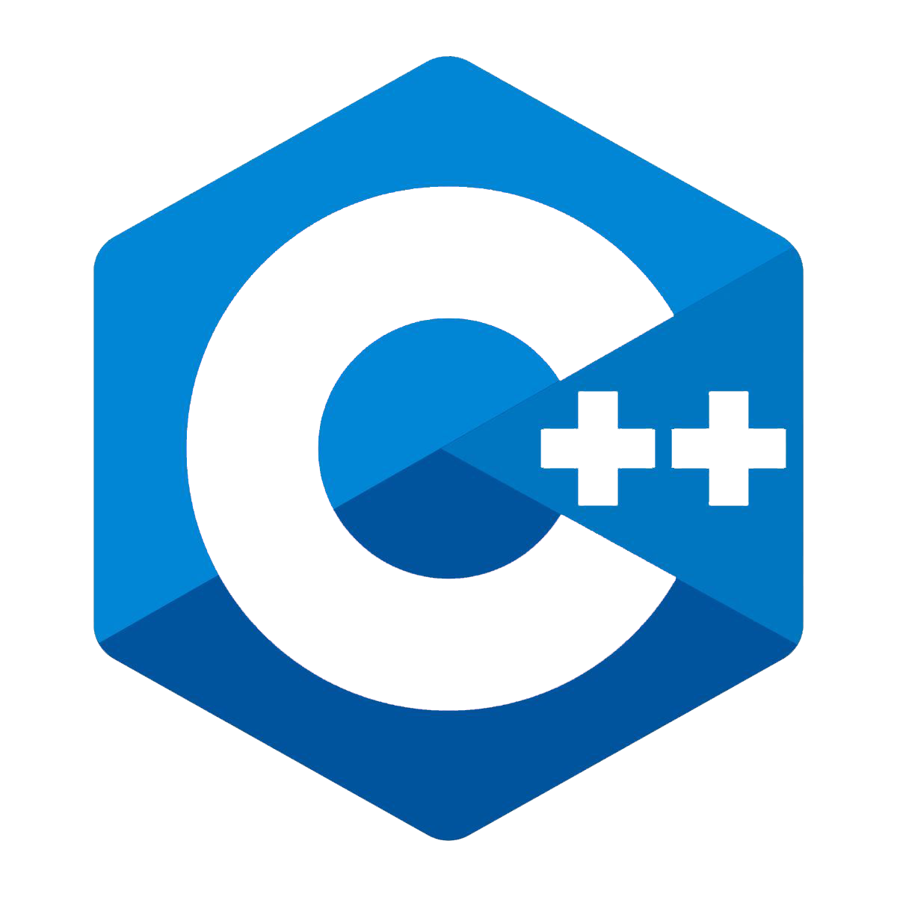
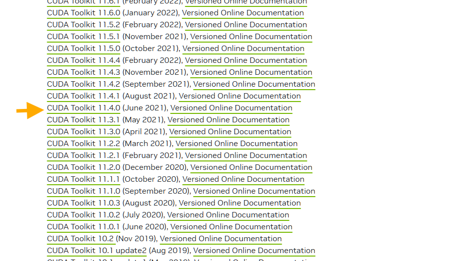

## For Developers

To compile and use this project with a **compatible** LLM.

### MAKE SURE THAT YOU HAVE A CUDA-COMPATIBLE NVIDIA GPU!

Of course, this is specifically designed with the **GT 730, Kepler-era 2GB VRAM card**. Support for other GPUs is *not required* but are welcome as additions to the project.

First, `git clone` this repo:

```bash
git clone https://github.com/GizmoWizardNet/n730.git
```
---
<p align="center">
  
</p>

**NOTE** - For compiling the core, I've always found VS 2019 to be the best handling all of this, using the MSVC `cl` compiler and in the *x64 Native Tools command prompt*.

Compile the CPP core:

```bash
cd src-code\cpp

# Using cl.exe (installed with VS, with the C++ Desktop Workload)
cl /O2 /arch:AVX2 /LD n730core.cpp /Fe:n730core.dll

# Using mingw or g++ or an equivalent compiler
g++ -O3 -march=native -shared -o n730core.dll n730core.cpp
```
---

<p align="center">
  
</p>

Then you will need the CUDA Runtime. Scroll down for version `11.4` and download(as well as install) it, [here](https://developer.nvidia.com/cuda-toolkit-archive).



### Compile the kernel

```powershell
# Operating in the normal command prompt

cd src-code\cpp

drive_letter:/path/to/cuda/bin/nvcc.exe -O3 -arch=sm_35 --shared -lcublas -o n730_cuda.dll n730_cuda.cu
```

**This will produce the final DLLs that N730 needs to operate.** 

---
<p align="center">
  
</p>

Now, for the final dependencies, you will need Python, hopefully `3.11` or higher. Download Python [here](https://www.python.org/downloads/).

Run `python3 setup.py` to run setup and auto-configure a model. It will, however ask for a **bin path** to be added, otherwise inference will explode. The bin path to be added is the same path used for `nvcc`, but just till the `bin` directory, eg:

```bash
# Path to be inputted
drive_letter:/path/to/cuda/bin
```

Select you model and you are ready to chat!

Contributions
---

Contributions are always welcome but -

- Do **NOT** open PRs for non-critical/inconsequential bugs, spelling fixes or cleaning up the TUI. Use *issues* instead. **Such PRs may be rejected without notice**.

- Use PRs *responsibly*. Do not spam them, and use one PR for every **feat/bug/fix/minor** added/removed.

### HAVE FUN! 🥳🥳🥳
